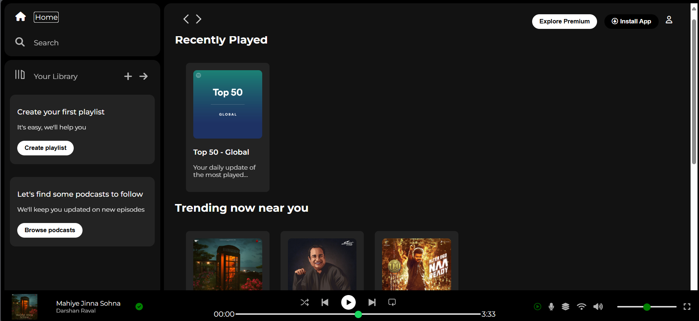

# 🎧 Spotify UI Clone (HTML & CSS Only)

A static front-end clone of Spotify's homepage built using pure **HTML** and **CSS**.  
This project was created as a layout and design practice, aiming to replicate the Spotify web interface for desktop screen sizes.

---

## 📸 Screenshot

## 🚀 Features

- 🎨 Spotify-like dark-themed UI
- 📚 Sidebar navigation (Home, Search, Library)
- 🔊 Music bar layout with play controls
- 📦 Song/album cards and sections (Trending, Recently Played)

---

## ⚠️ Limitations

- ❌ Not responsive (optimized only for laptop/desktop screen sizes)
- ❌ No functional JavaScript or audio controls
- ❌ No real music API or backend

---

## 🛠️ Tech Stack

- **HTML5**
- **CSS3**
  - Flexbox
  - Grid
  - Positioning
  - Basic transitions

---

## 💡 What I Learned

- Structuring semantic HTML for a complex layout
- Designing clean and consistent UI using CSS
- Implementing scrollable sections and media control layouts
- Understanding how real-world app UIs are built from scratch

---

## 📁 Folder Structure

SpotifyClone/
|
|-assets/
|-.gitignore
|-index.html
|-README.md
|-screenshot.png
|-style.css

